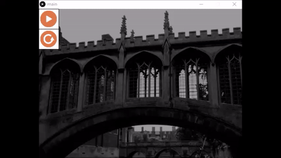
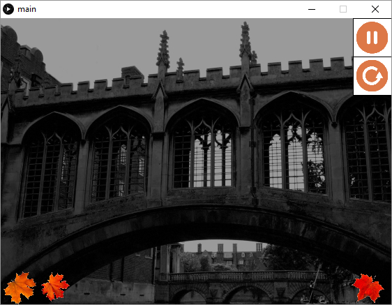

# music-player v1.0.8
A music player where user may simply click play to play the music with pause and stop button on the side. At the bottom, the leaves will be moving toward right and wrap back up on the left if the song is still playing otherwise it simply disappear.

## Requirements
- [Processing](https://processing.org/download/)

## Demo

## Authors
[Poan Chen](https://github.com/poanchen) and Mandy.